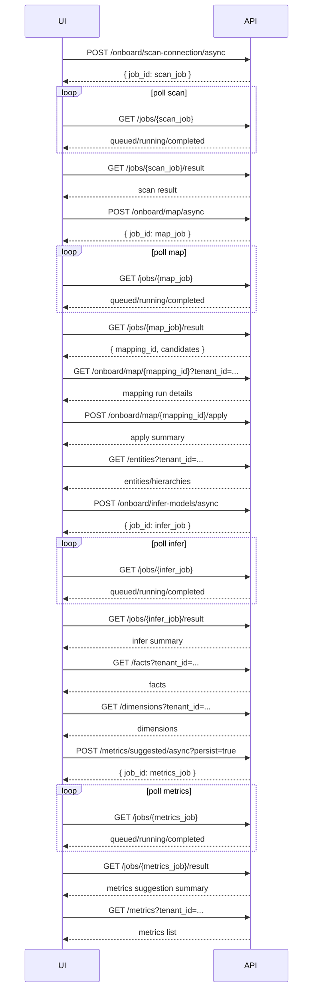

# UI Onboarding API Flows (Frontend Guide)

This guide is for UI/UX developers to implement the onboarding journey with correct API order, loading states, and empty states.

## 1) Core Async Pattern (Use Everywhere)

For async endpoints:
1. `POST .../async` -> get `{ "job_id": "...", "status": "queued" }`
2. Poll `GET /jobs/{job_id}` until `status` is `completed | failed | canceled`
3. On `completed`, call `GET /jobs/{job_id}/result`
4. Render result + refresh downstream read APIs

If status is `failed` or `canceled`, show error/failed state from `GET /jobs/{job_id}/result`.

---

## 2) Recommended UI Screen Flow

### Screen A: Scan Data Source
- Trigger: `POST /onboard/scan-connection/async`
- Poll job + fetch result.
- On success: move user to mapping step.

### Screen B: Entity Mapping Review
- Trigger: `POST /onboard/map/async`
- Poll job + fetch result from `GET /jobs/{job_id}/result`
- Read `mapping_id` from result.
- Fetch full mapping run: `GET /onboard/map/{mapping_id}?tenant_id=...`
- Apply selected/all candidates:
  - `POST /onboard/map/{mapping_id}/apply`
- Refresh canonical entities view:
  - `GET /entities?tenant_id=...`

Important:
- UI should use canonical reads (`/entities`), not legacy mapping tables.

### Screen C: Facts/Dimensions Inference
- Trigger: `POST /onboard/infer-models/async`
- Poll job + fetch result.
- Refresh:
  - `GET /facts?tenant_id=...`
  - `GET /dimensions?tenant_id=...`

Important:
- First run can show empty lists until async infer completes.

### Screen D: Metrics Suggestion + Review
- Trigger: `POST /metrics/suggested/async?persist=true`
- Poll job + fetch result.
- Refresh:
  - `GET /metrics?tenant_id=...`
- For promote/edit:
  - `PATCH /metrics/{metric_id}`

Important:
- First run can show empty list until metrics async job completes.

---

## 3) UI States to Implement

For each async step:
- `queued/running`: progress state + disable “Next”
- `completed`: success state + load next data
- `failed/canceled`: retry state + show error

For list pages (`entities`, `facts`, `dimensions`, `metrics`):
- Empty state: “No artifacts yet. Run previous step.”
- Loaded state: show lifecycle fields (`status`/`lifecycle_status`, `version_no`, `is_current`) where useful.

---

## 4) Minimal End-to-End API Sequence

1. `POST /onboard/scan-connection/async`
2. `GET /jobs/{scan_job_id}` -> `GET /jobs/{scan_job_id}/result`
3. `POST /onboard/map/async`
4. `GET /jobs/{map_job_id}` -> `GET /jobs/{map_job_id}/result`
5. `GET /onboard/map/{mapping_id}?tenant_id=...`
6. `POST /onboard/map/{mapping_id}/apply`
7. `GET /entities?tenant_id=...`
8. `POST /onboard/infer-models/async`
9. `GET /jobs/{infer_job_id}` -> `GET /jobs/{infer_job_id}/result`
10. `GET /facts?tenant_id=...`
11. `GET /dimensions?tenant_id=...`
12. `POST /metrics/suggested/async?persist=true`
13. `GET /jobs/{metrics_job_id}` -> `GET /jobs/{metrics_job_id}/result`
14. `GET /metrics?tenant_id=...`

---

## 5) Common UX Mistakes to Avoid

- Don’t call `GET /entities` immediately after map async completion without calling map apply.
- Don’t assume `/facts`, `/dimensions`, `/metrics` are non-empty on first run.
- Don’t skip `GET /jobs/{job_id}/result`; job completion alone is not the final payload.

---

## 6) Sequence Diagram (Mermaid)

