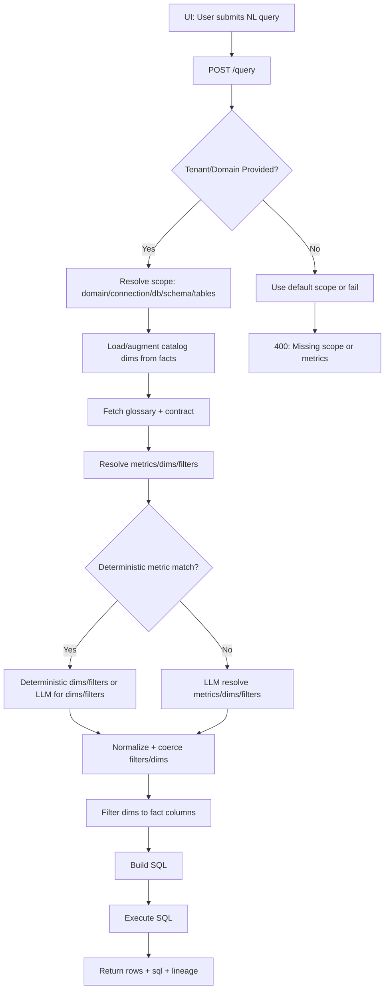

**Chart Inference + Async Rendering Plan (amCharts 5)**

**Goals**
1. `POST /charts` returns `chart_id` immediately.
2. `GET /charts/{chart_id}` returns `status` + **amCharts 5 model payload** + data when ready.
3. Use LLM **only for ambiguity**, otherwise deterministic.

**Phase 1: Data Model**
Add table `public.quantyx_chart_requests`:
- `chart_id` (PK, UUID or string)
- `tenant_id`
- `domain_id`
- `question`
- `query_payload` (JSON: question/metrics/dims/filters)
- `sql` (text)
- `params` (JSON)
- `rows_json` (JSON)
- `chart_type` (enum: `pie|bar|line`)
- `chart_payload` (JSON)  <-- amCharts 5 spec below
- `chart_data` (JSON)     <-- normalized data for chart
- `status` (enum: `queued|running|ready|failed`)
- `error_message` (text)
- `timing_ms` (JSON: resolve/build/exec/chart)
- `created_at`, `updated_at`

Optional related tables (if you want normalized history later):
- `public.quantyx_chart_events`
  - `event_id` (PK)
  - `chart_id` (FK to `quantyx_chart_requests`)
  - `event_type` (`queued|running|ready|failed|retried`)
  - `details` (JSON)
  - `created_at`

**Phase 2: API**
1. `POST /charts`
   - Input: `{ tenant_id, question, optional: metrics/dimensions/filters }`
   - Output: `{ chart_id, status: "queued" }`
2. `GET /charts/{chart_id}`
   - Output: `{ chart_id, status, chart_type, chart_payload, rows_json, sql }` (when ready)

**API Payloads (Detailed)**

`POST /charts`
```json
{
  "tenant_id": "VC_101",
  "domain_id": "lpg_production_distribution",
  "question": "What is total LPG production by plant last week?",
  "metrics": null,
  "dimensions": null,
  "filters": null,
  "limit": 200
}
```
Response:
```json
{
  "chart_id": "chart_2f7a9c4d",
  "status": "queued"
}
```

`GET /charts/{chart_id}` (queued)
```json
{
  "chart_id": "chart_2f7a9c4d",
  "status": "running"
}
```

`GET /charts/{chart_id}` (ready)
```json
{
  "chart_id": "chart_2f7a9c4d",
  "status": "ready",
  "chart_type": "bar",
  "chart_payload": {
    "root": { "useTheme": "Animated" },
    "chart": { "type": "XYChart", "panX": false, "panY": false },
    "xAxis": { "type": "CategoryAxis", "categoryField": "category" },
    "yAxis": { "type": "ValueAxis" },
    "series": [
      {
        "type": "ColumnSeries",
        "name": "Production (MT)",
        "valueYField": "value",
        "categoryXField": "category"
      }
    ],
    "legend": { "type": "Legend" }
  },
  "data": [
    { "category": "Plant A", "value": 123.4 },
    { "category": "Plant B", "value": 98.1 }
  ],
  "sql": "SELECT ...",
  "params": ["2026-02-16", "2026-02-22"],
  "rows_json": [
    { "sap_id": "Plant A", "production_mt": 123.4 },
    { "sap_id": "Plant B", "production_mt": 98.1 }
  ]
}
```

`GET /charts/{chart_id}` (failed)
```json
{
  "chart_id": "chart_2f7a9c4d",
  "status": "failed",
  "error_message": "No metrics resolved"
}
```

**Phase 3: Async Worker**
Steps:
1. Resolve metrics/dimensions/filters (existing query logic).
2. Build SQL + run query.
3. Infer chart type + build amCharts payload.
4. Persist `chart_payload`, `rows_json`, `sql`, `params`, `status=ready`.

**Phase 4: Chart Inference Rules**
Deterministic first, LLM only if ambiguous:
- 1 dim + 1 metric
  - time dim → `line`
  - category dim → `bar` (if <= 10 rows, prefer `pie`)
- 2 dims + 1 metric
  - one time dim → `line` with series by other dim
  - both categorical → `bar` (stacked)
- no dims → no chart (return `chart_type=null`)

If rules don’t select a type with confidence, call LLM with:
- question
- metrics
- dimensions
- row sample
- allowed chart types

**Phase 5: amCharts 5 Payloads (Standard)**

All responses include:
```json
{
  "chart_id": "chart_123",
  "chart_type": "pie|bar|line",
  "chart_payload": { ... },
  "data": [ ... ]  // normalized series data
}
```

**Pie (amCharts 5)**
```json
{
  "chart_type": "pie",
  "chart_payload": {
    "root": { "useTheme": "Animated" },
    "chart": { "type": "PieChart" },
    "series": {
      "type": "PieSeries",
      "valueField": "value",
      "categoryField": "category"
    },
    "legend": { "type": "Legend" }
  },
  "data": [
    { "category": "Plant A", "value": 123.4 },
    { "category": "Plant B", "value": 98.1 }
  ]
}
```
**Pie (Response Example)**
```json
{
  "chart_id": "chart_7a1f",
  "status": "ready",
  "chart_type": "pie",
  "chart_payload": {
    "root": { "useTheme": "Animated" },
    "chart": { "type": "PieChart" },
    "series": {
      "type": "PieSeries",
      "valueField": "value",
      "categoryField": "category"
    },
    "legend": { "type": "Legend" }
  },
  "data": [
    { "category": "Plant A", "value": 123.4 },
    { "category": "Plant B", "value": 98.1 }
  ]
}
```

**Bar (amCharts 5 XYChart)**
```json
{
  "chart_type": "bar",
  "chart_payload": {
    "root": { "useTheme": "Animated" },
    "chart": { "type": "XYChart", "panX": false, "panY": false },
    "xAxis": { "type": "CategoryAxis", "categoryField": "category" },
    "yAxis": { "type": "ValueAxis" },
    "series": [
      {
        "type": "ColumnSeries",
        "name": "Production (MT)",
        "valueYField": "value",
        "categoryXField": "category"
      }
    ],
    "legend": { "type": "Legend" }
  },
  "data": [
    { "category": "Plant A", "value": 123.4 },
    { "category": "Plant B", "value": 98.1 }
  ]
}
```
**Bar (Response Example)**
```json
{
  "chart_id": "chart_5c2b",
  "status": "ready",
  "chart_type": "bar",
  "chart_payload": {
    "root": { "useTheme": "Animated" },
    "chart": { "type": "XYChart", "panX": false, "panY": false },
    "xAxis": { "type": "CategoryAxis", "categoryField": "category" },
    "yAxis": { "type": "ValueAxis" },
    "series": [
      {
        "type": "ColumnSeries",
        "name": "Production (MT)",
        "valueYField": "value",
        "categoryXField": "category"
      }
    ],
    "legend": { "type": "Legend" }
  },
  "data": [
    { "category": "Plant A", "value": 123.4 },
    { "category": "Plant B", "value": 98.1 }
  ]
}
```

**Line (amCharts 5 XYChart)**
```json
{
  "chart_type": "line",
  "chart_payload": {
    "root": { "useTheme": "Animated" },
    "chart": { "type": "XYChart", "panX": true, "panY": false },
    "xAxis": { "type": "DateAxis", "baseInterval": { "timeUnit": "day", "count": 1 } },
    "yAxis": { "type": "ValueAxis" },
    "series": [
      {
        "type": "LineSeries",
        "name": "Production (MT)",
        "valueYField": "value",
        "valueXField": "date"
      }
    ],
    "legend": { "type": "Legend" }
  },
  "data": [
    { "date": "2026-02-16", "value": 100.2 },
    { "date": "2026-02-17", "value": 110.5 }
  ]
}
```
**Line (Response Example)**
```json
{
  "chart_id": "chart_91b7",
  "status": "ready",
  "chart_type": "line",
  "chart_payload": {
    "root": { "useTheme": "Animated" },
    "chart": { "type": "XYChart", "panX": true, "panY": false },
    "xAxis": { "type": "DateAxis", "baseInterval": { "timeUnit": "day", "count": 1 } },
    "yAxis": { "type": "ValueAxis" },
    "series": [
      {
        "type": "LineSeries",
        "name": "Production (MT)",
        "valueYField": "value",
        "valueXField": "date"
      }
    ],
    "legend": { "type": "Legend" }
  },
  "data": [
    { "date": "2026-02-16", "value": 100.2 },
    { "date": "2026-02-17", "value": 110.5 }
  ]
}
```

**Phase 6: Observability**
Store `timing_ms` per step:
```json
{
  "resolve_ms": 1200,
  "sql_build_ms": 40,
  "sql_exec_ms": 900,
  "chart_infer_ms": 20
}
```

**Phase 7: LLM Ambiguity Rules**
Call LLM only if:
- multiple chart types match equally
- missing dimension type signal (time vs category)
- multiple metrics or multiple dimensions not handled by rules

**Deliverables**
1. DB migration for `quantyx_chart_requests`
2. `POST /charts`, `GET /charts/{chart_id}`
3. Background worker for chart build
4. Documented amCharts payloads (this doc)

**Mermaid: `/query` NL Flow**


**Mermaid: `/charts` Async Flow**
```mermaid
flowchart TD
  A[UI: User submits NL query] --> B[POST /charts]
  B --> C[Create chart_request row: status=queued]
  C --> D[Return chart_id to UI]
  D --> E[UI polls GET /charts/{chart_id}]
  E --> F{status}
  F -->|queued/running| E
  F -->|ready| G[Return chart_payload + data]
  C --> H[Worker picks queued chart_id]
  H --> I[Resolve metrics/dims/filters]
  I --> J[Build SQL + execute]
  J --> K[Infer chart type]
  K --> L[Build amCharts payload]
  L --> M[Update chart_request row: status=ready]
```

**UI Polling Pattern**
1. `POST /charts` → receive `chart_id`
2. Poll `GET /charts/{chart_id}` every 1–2s (use exponential backoff up to 10s)
3. When `status=ready`, render chart using `chart_payload` + `data`

Example polling response:
```json
{
  "chart_id": "chart_2f7a9c4d",
  "status": "ready",
  "chart_type": "bar",
  "chart_payload": { "...": "..." },
  "data": [ ... ]
}
```
