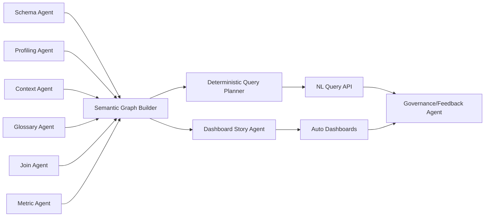

# Phase 01: Agentic Intake + Schema Understanding

## Objective
Deploy multiple agents to ingest schema + context and build a normalized semantic graph that captures tables, columns, keys, metrics, and join paths.

---

## Agent Inventory (Minimum 8)

1. **Schema Agent**
   - Reads DB schema
   - Extracts tables, columns, PK/FK, datatypes
   - Outputs normalized schema graph

2. **Profiling Agent**
   - Samples data for cardinality, nulls, min/max
   - Detects grains and time columns
   - Suggests measures vs dimensions

3. **Context Agent**
   - Parses business context text
   - Extracts entity definitions + hierarchy hints

4. **Glossary Agent**
   - Builds glossary terms + synonyms
   - Normalizes abbreviations

5. **Join Agent**
   - Proposes join paths between tables
   - Uses PK/FK + naming heuristics
   - Scores confidence

6. **Metric Agent**
   - Proposes metric formulas
   - Links metrics to base facts
   - Validates formula fields

7. **Dashboard Story Agent**
   - Picks chart story arcs
   - Defines KPI cards + trends + breakdowns
   - Outputs dashboard spec

8. **Governance/Feedback Agent**
   - Tracks confirmations + corrections
   - Updates confidence + approvals
   - Maintains audit log

---

## Execution Flow (Parallel Agents)

---

## Outputs
- `schema_graph.json`
- `fact_candidates.json`
- `dim_candidates.json`
- `semantic_nodes` + `semantic_edges`
- `dashboard_spec.json`

---

## Notes
- First live baseline is generated **from schema only** (no context required).
- Context can be supplied **later via chat** to refine semantics and regenerate views/dashboards.
- When context changes, re-run agents and refresh derived views/actions on a schedule.
