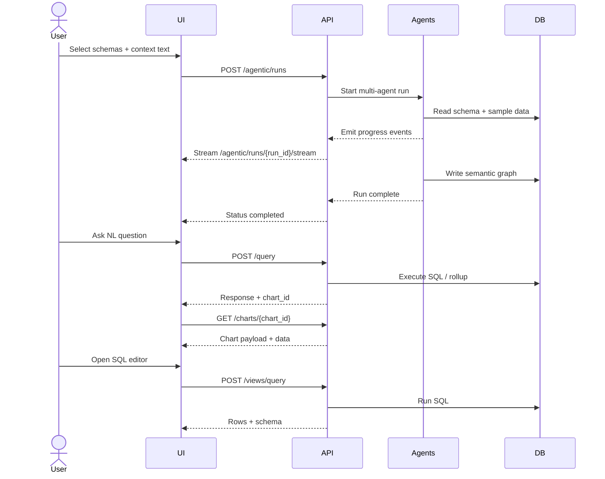

# Phase 13: Public API Specs (No Auth for Now)

## Objective
Define all REST APIs needed for the agentic semantic platform with clean payloads and consistent naming. Authentication is intentionally ignored for now.

> All endpoints use JSON. Every request includes `tenant_id` and optional `domain_id`.

---

# 1) Agentic Runs

## POST /agentic/runs
Start a full multi‑agent semantic build.

Request:
```json
{
  "tenant_id": "VC_101",
  "domain_id": "lpg_production_distribution",
  "schema_ids": ["schema_abc"],
  "context_text": "<business context text>",
  "mode": "full"
}
```

Response:
```json
{ "run_id": "run_123", "status": "queued" }
```

---

## GET /agentic/runs/{run_id}
Return run status.

Response:
```json
{ "run_id": "run_123", "status": "running" }
```

---

## GET /agentic/runs/{run_id}/events
Return progress events.

Response:
```json
{
  "events": [
    {"agent": "schema", "status": "completed", "message": "Loaded 12 tables"}
  ]
}
```

---

## GET /agentic/runs/{run_id}/stream
Server‑sent events stream (optional).

---

### ChartPlannerAgent (within agentic run)
ChartPlannerAgent runs inside `/agentic/runs` and emits artifacts:
- `chart_candidates`
- `chart_plan` (4–8 charts)

## GET /agentic/runs/{run_id}/chat
Return stored summary stream.

Response:
```json
{
  "messages": [
    {"sender": "agent", "message": "Profiling Agent completed: detected 4 facts."}
  ]
}
```

---

# 2) Semantic Graph

## GET /semantic/nodes
List semantic nodes.

Request (query params):
```
?tenant_id=VC_101&domain_id=lpg_production_distribution&node_type=metric
```

Response:
```json
{ "nodes": [ {"node_id": "n1", "type": "metric", "name": "production_mt"} ] }
```

---

## GET /semantic/edges
List semantic edges.

Request (query params):
```
?tenant_id=VC_101&domain_id=lpg_production_distribution&edge_type=concept_metric
```

Response:
```json
{ "edges": [ {"edge_id": "e1", "type": "concept_metric", "confidence": 0.82} ] }
```

---

# 2.1) Semantic Feedback

## POST /semantic/feedback
Submit feedback on a semantic edge.

Request:
```json
{
  "tenant_id": "VC_101",
  "domain_id": "lpg_production_distribution",
  "edge_id": "edge_123",
  "action": "confirm",
  "delta_confidence": 0.1,
  "notes": "Correct mapping"
}
```

Response:
```json
{
  "feedback_id": "fb_123",
  "tenant_id": "VC_101",
  "domain_id": "lpg_production_distribution",
  "edge_id": "edge_123",
  "action": "confirm",
  "delta_confidence": 0.1,
  "notes": "Correct mapping"
}
```

## GET /semantic/feedback
List semantic feedback entries.

Request (query params):
```
?tenant_id=VC_101&domain_id=lpg_production_distribution
```

Response:
```json
[
  {
    "feedback_id": "fb_123",
    "edge_id": "edge_123",
    "action": "confirm",
    "delta_confidence": 0.1
  }
]
```

---

# 3) NL Query

## POST /query
Deterministic query resolver.

Request:
```json
{
  "tenant_id": "VC_101",
  "domain_id": "lpg_production_distribution",
  "question": "What is total LPG production by region last week?",
  "limit": 100,
  "explain": true
}
```

Response:
```json
{
  "metrics": ["production_mt"],
  "dimensions": ["region"],
  "sql": "SELECT ...",
  "rows": [],
  "chart_id": "chart_abc",
  "chart": {
    "type": "bar",
    "payload": { "x": "region", "y": "production_mt" }
  }
}
```

**Chart Support:** All chart types supported by amCharts must be supported. Chart selection is determined by a **Chart Agent** that uses the user question, resolved metrics/dimensions, and row shape to choose the best chart type.

---

# 3.1) Chat API

## POST /chat
Chat-style query with sync/async mode.

Request:
```json
{
  "tenant_id": "VC_101",
  "domain_id": "lpg_production_distribution",
  "question": "What is total LPG production by region last week?",
  "mode": "sync"
}
```

Response:
```json
{
  "status": "complete",
  "response": {
    "metrics": ["production_mt"],
    "dimensions": ["region"],
    "sql": "SELECT ...",
    "rows": [],
    "chart_id": "chart_abc",
    "chart_type": "bar",
    "chart_payload": { "root": {}, "chart": {} },
    "data": []
  }
}
```

## GET /chat/{chat_id}
Poll async chat response.

Response:
```json
{
  "chat_id": "chat_123",
  "status": "complete",
  "response": {
    "metrics": ["production_mt"],
    "dimensions": ["region"],
    "sql": "SELECT ...",
    "rows": []
  }
}
```

## GET /chat/{chat_id}/events
List chat progress events.

Response:
```json
{
  "events": [
    {"event_type": "resolve", "message": "Resolving metrics and dimensions"}
  ]
}
```

## GET /chat/{chat_id}/stream
SSE stream of chat events.

---

# 4) Dashboards

## POST /dashboards/auto
Generate an auto‑dashboard.

Request:
```json
{ "tenant_id": "VC_101", "domain_id": "lpg_production_distribution" }
```

Response:
```json
{ "dashboard_id": "dash_123", "status": "ready" }
```

---

## GET /dashboards/{dashboard_id}
Return dashboard spec.

Response:
```json
{ "dashboard_id": "dash_123", "spec": {"cards": [], "charts": []} }
```

---

# 4.1) List Dashboards

## GET /dashboards
List dashboards for tenant.

Request (query params):
```
?tenant_id=VC_101&domain_id=lpg_production_distribution
```

Response:
```json
{
  "dashboards": [
    {
      "dashboard_id": "dash_123",
      "tenant_id": "VC_101",
      "domain_id": "lpg_production_distribution",
      "title": "Auto Dashboard"
    }
  ]
}
```

---

# 5) Rollups

## POST /rollups
Create rollup definition.

Request:
```json
{
  "tenant_id": "VC_101",
  "domain_id": "lpg_production_distribution",
  "metric_name": "production_mt",
  "dimensions": ["region"],
  "time_grain": "month",
  "build_now": true
}
```

Response:
```json
{ "rollup_id": "rollup_123", "status": "active" }
```

---

## GET /rollups
List rollups.

Request (query params):
```
?tenant_id=VC_101&domain_id=lpg_production_distribution
```

Response:
```json
{ "rollups": [ {"rollup_id": "rollup_123", "metric_name": "production_mt"} ] }
```

---

## POST /rollups/{rollup_id}/refresh
Refresh rollup table.

Request:
```json
{ "tenant_id": "VC_101" }
```

Response:
```json
{ "rollup_id": "rollup_123", "status": "refreshing" }
```

---

# 6) Charts

## GET /charts/{chart_id}
Poll chart build result.

Response:
```json
{ "chart_id": "chart_abc", "status": "ready", "chart_payload": {} }
```

---

# 7) Views

## GET /views
List views.

Request (query params):
```
?tenant_id=VC_101&domain_id=lpg_production_distribution
```

Response:
```json
{
  "views": [
    {
      "view_name": "fact_lpg_plant_operations",
      "schema": "public",
      "type": "fact",
      "source_table": "lpg_plant_operations"
    }
  ]
}
```

## GET /views/{view_name}/schema
Return view schema.

Request (query params):
```
?tenant_id=VC_101
```

Response:
```json
{
  "view_name": "fact_lpg_plant_operations",
  "schema": "public",
  "columns": [
    {"column_name": "sap_id", "data_type": "text"},
    {"column_name": "process_date", "data_type": "date"}
  ]
}
```

## POST /views/query
Run SQL query.

Request:
```json
{
  "tenant_id": "VC_101",
  "sql": "SELECT * FROM public.fact_lpg_plant_operations LIMIT 100"
}
```

Response:
```json
{
  "rows": [],
  "columns": ["sap_id", "process_date"],
  "row_count": 0,
  "chart": { "type": "table", "payload": {"columns": ["sap_id", "process_date"]} }
}
```

---

## Notes
- All endpoints accept `tenant_id` and optional `domain_id`.
- Payloads follow REST JSON conventions.
- No auth included yet.

---

# Lifecycle Diagram (Mermaid)

```mermaid
flowchart LR
  A[Connect Data Source] --> B[Select Schemas]
  B --> C[POST /agentic/runs]
  C --> D[Multi-Agent Processing]
  D --> E[Semantic Graph Ready]
  E --> F[Auto Dashboard]
  E --> G[NL Query]
  F --> H[GET /dashboards/{id}]
  G --> I[POST /query]
  I --> J[GET /charts/{chart_id}]
  E --> K[View Explorer + SQL Editor]
```

---

# Sequence Diagram (Mermaid)


