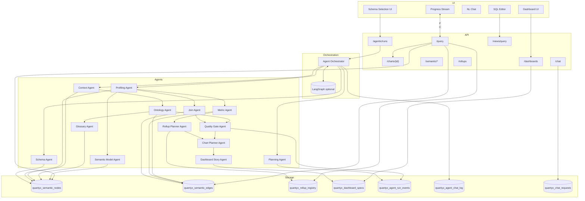
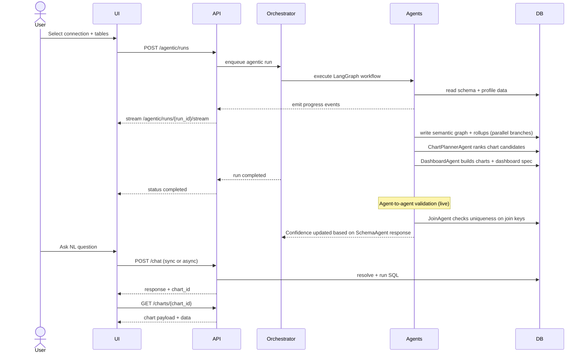

# Phase 19: System Architecture (Agentic Semantic Platform)

## Objective
Provide a clear end‑to‑end architecture diagram for the multi‑agent semantic platform, including optional LangGraph orchestration.

---

## Architecture Diagram (Mermaid)

---

## Sequence Diagram (Mermaid)

---

## Notes
- **LangGraph optional**: use if we need explicit agent graph orchestration.
- **Agent Orchestrator** can be our existing job system + event stream.
- **All outputs persist into quantyx_* tables**.
- **Agent-to-agent interactions are live**: JoinAgent issues SchemaAgent uniqueness checks and records request/response in `quantyx_agent_run_events`.
