# Phase 19: System Architecture (Agentic Semantic Platform)

## Objective
Provide a clear end‑to‑end architecture diagram for the multi‑agent semantic platform, including optional LangGraph orchestration.

---

## Architecture Diagram (Mermaid)

```mermaid
flowchart TB
  subgraph UI
    A[Schema Selection UI]
    B[Progress Stream]
    C[NL Chat]
    D[Dashboard UI]
    E[SQL Editor]
  end

  subgraph API
    F["/agentic/runs"]
    G["/query"]
    H["/charts/{id}"]
    I["/dashboards"]
    J["/views/query"]
    K["/semantic/*"]
    L1["/chat"]
    L2["/rollups"]
  end

  subgraph Orchestration
    L[Agent Orchestrator]
    M[(LangGraph optional)]
  end

  subgraph Agents
    S1[Schema Agent]
    S2[Profiling Agent]
    S3[Context Agent]
    S4[Glossary Agent]
    S5[Join Agent]
    S6[Metric Agent]
    S7[Semantic Model Agent]
    S8[Rollup Planner Agent]
    S9[Dashboard Story Agent]
    S10[Planning Agent]
    S11[Quality Gate Agent]
    S12[Ontology Agent]
  end

  subgraph Storage
    T1[(quantyx_semantic_nodes)]
    T2[(quantyx_semantic_edges)]
    T3[(quantyx_rollup_registry)]
    T4[(quantyx_dashboard_specs)]
    T5[(quantyx_agent_run_events)]
    T6[(quantyx_agent_chat_log)]
    T7[(quantyx_chat_requests)]
  end

  A --> F --> L --> S1
  L --> S2
  L --> S3
  L --> S4
  L --> S5
  L --> S6
  L --> S7
  L --> S8
  L --> S9
  L --> S10
  L --> S11
  L --> S12

  L --> T1
  L --> T2
  L --> T5
  L --> T6

  G --> T1
  G --> T2
  G --> T3
  G --> H
  L1 --> T7

  D --> I --> T4
  E --> J

  L <--> M
  B <-- F
  C --> G
```

---

## Notes
- **LangGraph optional**: use if we need explicit agent graph orchestration.
- **Agent Orchestrator** can be our existing job system + event stream.
- **All outputs persist into quantyx_* tables**.
