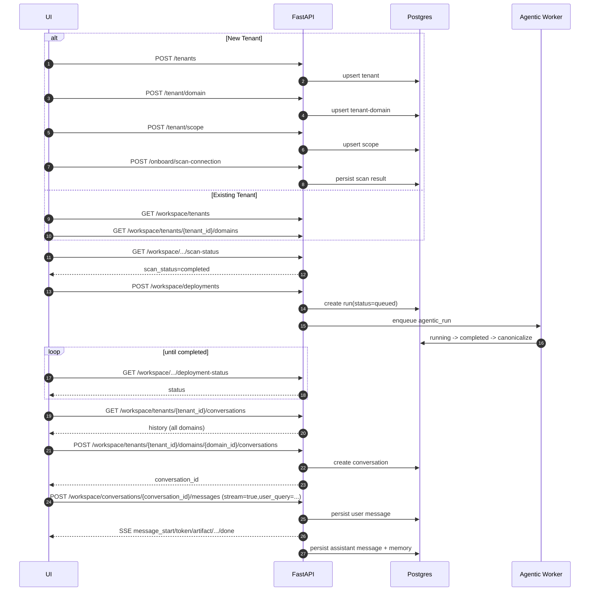
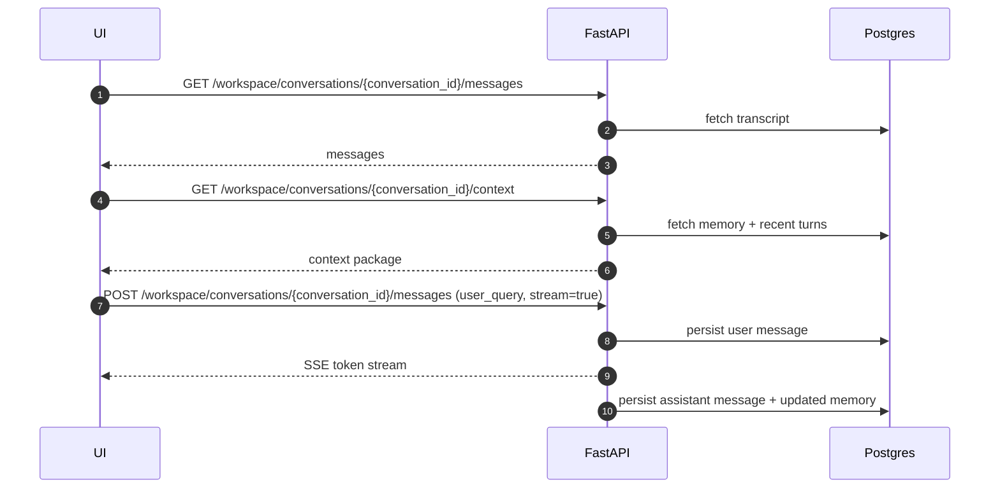

# Phase 26: Workspace UI Sequential API Flow

## Objective
Define one customer-facing API sequence for workspace onboarding and chat usage, starting from either:
1. creating a new tenant, or
2. selecting an existing tenant.

This document is the integration contract for UI teams.

---

## Canonical Request Contract (Important)
To keep payloads consistent across similar APIs:
- Use `user_query` as the canonical query field.
- Backend accepts aliases (`query`, `message_text`, `first_question`) for backward compatibility.
- UI should always send `user_query`.

---

## API Groups Used In Flow
1. Tenant bootstrap:
- `POST /tenants`
- `POST /tenant/domain`
- `POST /tenant/scope`

2. Scan and readiness:
- `POST /onboard/scan-connection` (or async variant)
- `GET /workspace/tenants/{tenant_id}/domains/{domain_id}/scan-status`

3. Deployment:
- `POST /workspace/deployments` (first build and rebuild; single canonical API)
- `GET /workspace/tenants/{tenant_id}/domains/{domain_id}/deployment-status`
- `GET /workspace/deployments/current?tenant_id=...&domain_id=...`

4. Conversation discovery:
- `GET /workspace/tenants/{tenant_id}/conversations` (all domains)
- `GET /workspace/tenants/{tenant_id}/domains/{domain_id}/conversations`
- `GET /workspace/tenants/{tenant_id}/domains/{domain_id}/runs/{run_id}/conversations`

5. Conversation creation and chat:
- `POST /workspace/tenants/{tenant_id}/domains/{domain_id}/conversations`
- `POST /workspace/conversations/{conversation_id}/messages` (SSE by default)
- `GET /workspace/conversations/{conversation_id}/messages`
- `GET /workspace/conversations/{conversation_id}/context`

---

## Flow A: New Tenant (First-Time Setup)

1. Create tenant
```http
POST /tenants
```

2. Bind tenant to default domain
```http
POST /tenant/domain
```

3. Persist tenant scope (connection/database/schema/tables)
```http
POST /tenant/scope
```

4. Run connection scan
```http
POST /onboard/scan-connection
```

5. Poll scan readiness until complete
```http
GET /workspace/tenants/{tenant_id}/domains/{domain_id}/scan-status
```

6. Start deployment build
```http
POST /workspace/deployments
```

7. Poll deployment readiness
```http
GET /workspace/tenants/{tenant_id}/domains/{domain_id}/deployment-status
```

8. Load tenant-wide conversation history (will be empty initially)
```http
GET /workspace/tenants/{tenant_id}/conversations
```

9. Start conversation
```http
POST /workspace/tenants/{tenant_id}/domains/{domain_id}/conversations
```
Request (canonical):
```json
{
  "user_query": "Show production trend by plant for last 30 days"
}
```

10. Send message with SSE stream
```http
POST /workspace/conversations/{conversation_id}/messages
```
Request:
```json
{
  "user_query": "Show production trend by plant for last 30 days",
  "resume_context": true,
  "stream": true
}
```

---

## Flow B: Existing Tenant (Returning User)

1. Load tenants
```http
GET /workspace/tenants
```

2. User selects tenant -> load domains/readiness
```http
GET /workspace/tenants/{tenant_id}/domains
```

3. If `deployment_status != completed`:
- show setup/processing state
- trigger deployment only through:
```http
POST /workspace/deployments
```

4. Load tenant-wide history across all domains
```http
GET /workspace/tenants/{tenant_id}/conversations
```

5. If user filters by selected domain:
```http
GET /workspace/tenants/{tenant_id}/domains/{domain_id}/conversations
```

6. Resume existing conversation:
- show transcript:
```http
GET /workspace/conversations/{conversation_id}/messages
```
- send new turn:
```http
POST /workspace/conversations/{conversation_id}/messages
```

7. Start new conversation for selected domain:
```http
POST /workspace/tenants/{tenant_id}/domains/{domain_id}/conversations
```

---

## Sequence Diagram: Tenant To First Streamed Reply



---

## Sequence Diagram: Resume Conversation



---

## UI Decision Table

1. On app load:
- call `GET /workspace/tenants`

2. On tenant select:
- call `GET /workspace/tenants/{tenant_id}/domains`
- call `GET /workspace/tenants/{tenant_id}/conversations`

3. On domain select:
- if `deployment_status != completed`, call `POST /workspace/deployments`
- else load `GET /workspace/tenants/{tenant_id}/domains/{domain_id}/conversations`

4. On "New Chat":
- call `POST /workspace/tenants/{tenant_id}/domains/{domain_id}/conversations`

5. On send:
- call `POST /workspace/conversations/{conversation_id}/messages` with `stream=true` and `user_query`

---

## Integration Guardrails
1. Do not call `/agentic/runs` from customer UI flow.
2. Use only `/workspace/deployments` for both initial build and new versions.
3. Always send `user_query` in conversation/message request bodies.
4. Treat IDs (`run_id`, `conversation_id`) as internal handles; show `display_name`/`title` in UI.
